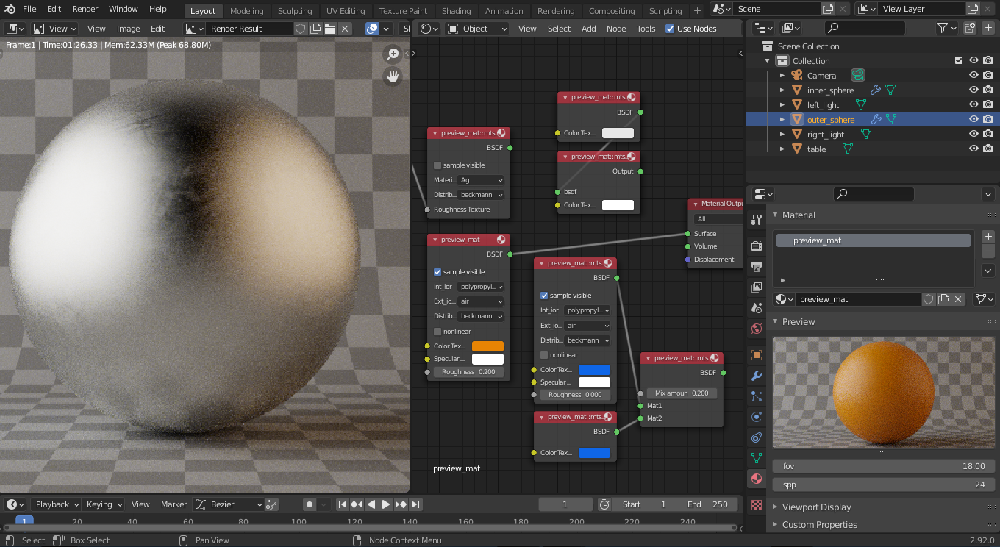

# mts2blender for Windows
## Mitsuba2 exporter/render engine add-on for Blender
(tested in Blender 2.9)

### How to use
- set mitsuba2 bin folder (under render properties tab)
- set project (where to export) folder (under render properties tab)
- hit render button
Render progress and info messages are printed the console (enable the console under Window -> Toggle System Console).
